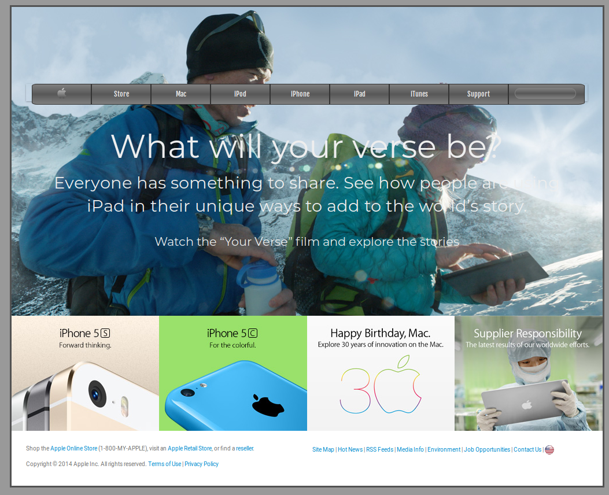

# Building-with-Backgrounds-and-Gradients
Page design with background images and gradient elements

## Table of Contents

* [About the Project](#about-the-project)
* [Built With](#built-with)
* [Getting Started](#getting-started)
* [License](#license)
* [Contact](#contact)
* [Acknowledgements](#acknowledgements)
* [Commit Summary](#commit-summary)

## About The Project

This project consists of building a webpage using images as a background and adding gradients to elements.
https://www.theodinproject.com/courses/html5-and-css3/lessons/building-with-backgrounds-and-gradients

### Built With 

* HTML
* CSS3
* Github
 
* building backgrounds with colors, images and gradients
* use of the box-model
* allignment properties
* positioning

## Getting Started

Just clone or download the project and open the index.html in your browser.

## License

Distributed under the MIT License. See `LICENSE` for more information.

## Contact
* Ricardo Valtierra - ricardo_valtierra@outlook.com

## Acknowledgements

* Microverse.

## Commit Summary
* Initial commit
* setup repository
* README.md edition
* main and body positioning with css structure
* css block design
* block format and position for main-content
* main-content positioning childs
* footer and grid section finished / image insertion and format
* HTML & CSS validation